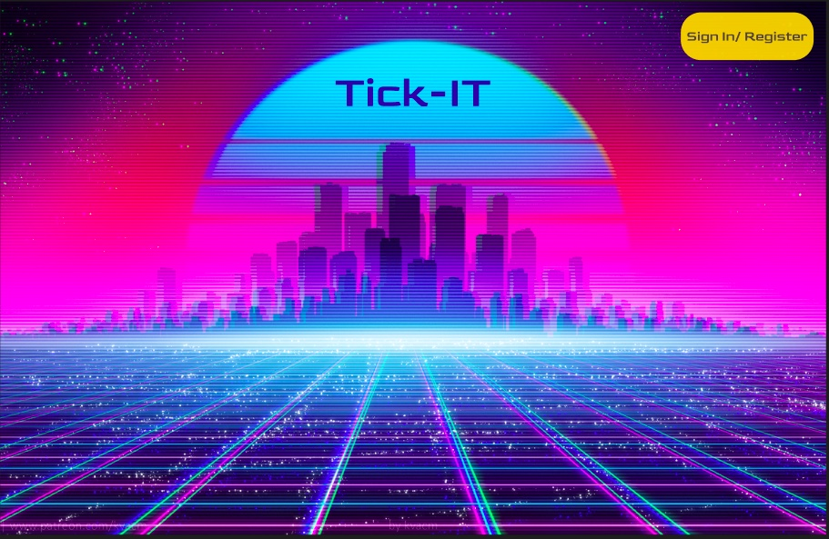
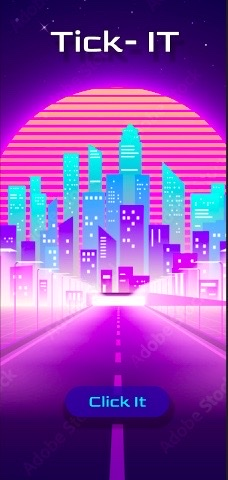
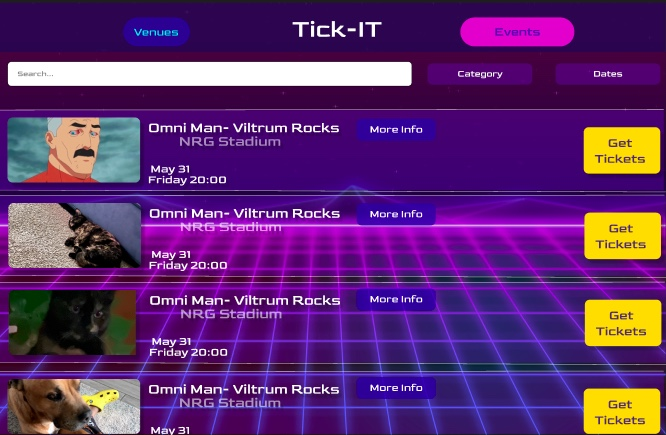
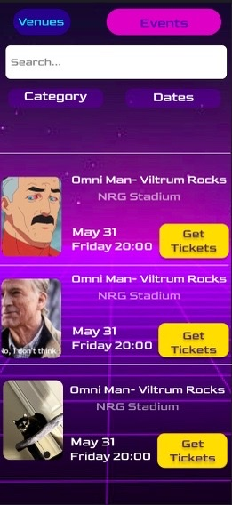
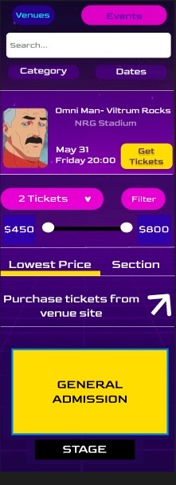
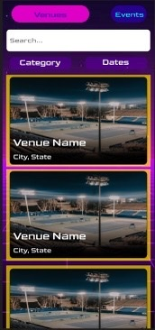
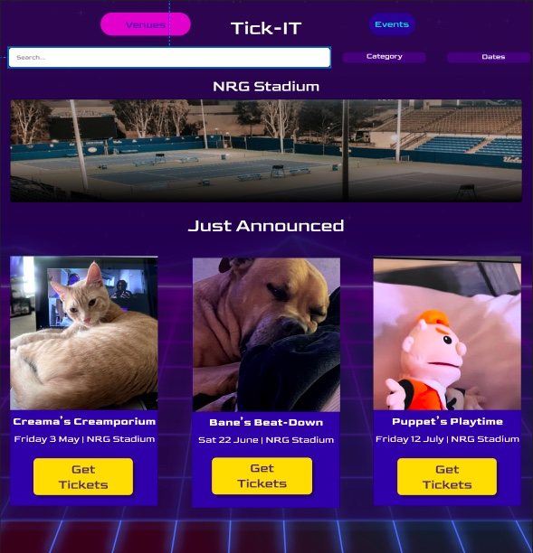
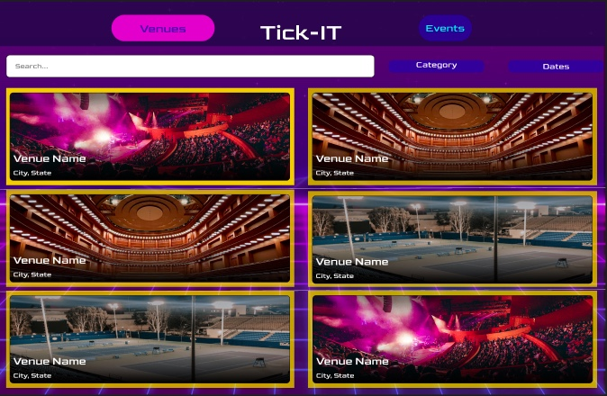
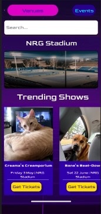
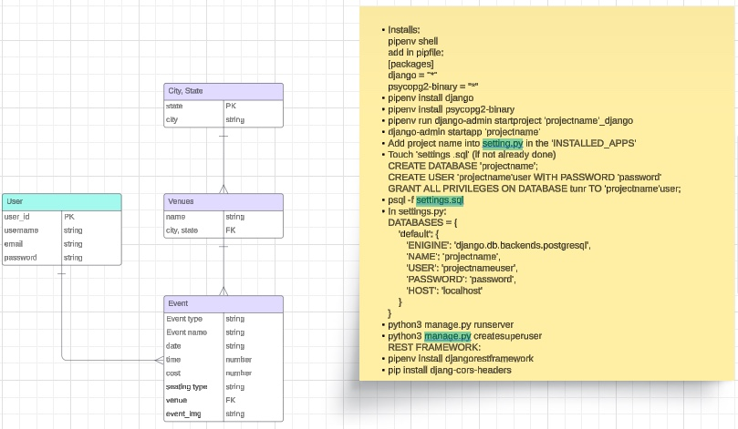

# Tick-IT

Welcome to Tick-IT! Tick-IT is a web application designed as a ticket purchasing site, offering users a comprehensive platform to discover and purchase tickets for various events. From concerts and sports events to theater performances and festivals, Tick-IT provides a seamless experience for event-goers to find and secure tickets to their favorite events.

## Wireframes and ERD
### Wireframes
Below are wireframes depicting the envisioned user interface of Tick-IT:

<!-- Fix links -->

,
,
,

### Entity-Relationship Diagram (ERD)
The following diagram illustrates the relationships between various entities within the Tick-IT database:

## Technologies Used
- **React**: A JavaScript library for building user interfaces.
- **Django Back-end**: A high-level Python web framework for building robust web applications.

## Packages Used
To enhance functionality and streamline development, Tick-IT utilizes the following packages:

- **React-router-dom**: Declarative routing for React applications.
- **Axios**: A promise-based HTTP client for making requests to the backend.

## Team Members:

- **Abraham Guerrero**: - [GitHub](https://github.com/AbeGue02) | [LinkedIn](https://www.linkedin.com/in/abrahamdguerrero/)
- **Christian Adams**: - [GitHub](https://github.com/Zekkune) | [LinkedIn](https://www.linkedin.com/in/christian-j-adams/)
- **Mia Hayes**: - [GitHub](https://github.com/MiaDHayes) | [LinkedIn](www.linkedin.com/in/mia-dehayes)
- **Scott Larson**: - [GitHub](https://github.com/Larsonscott89) | [LinkedIn](https://www.linkedin.com/in/scottlarson9/)